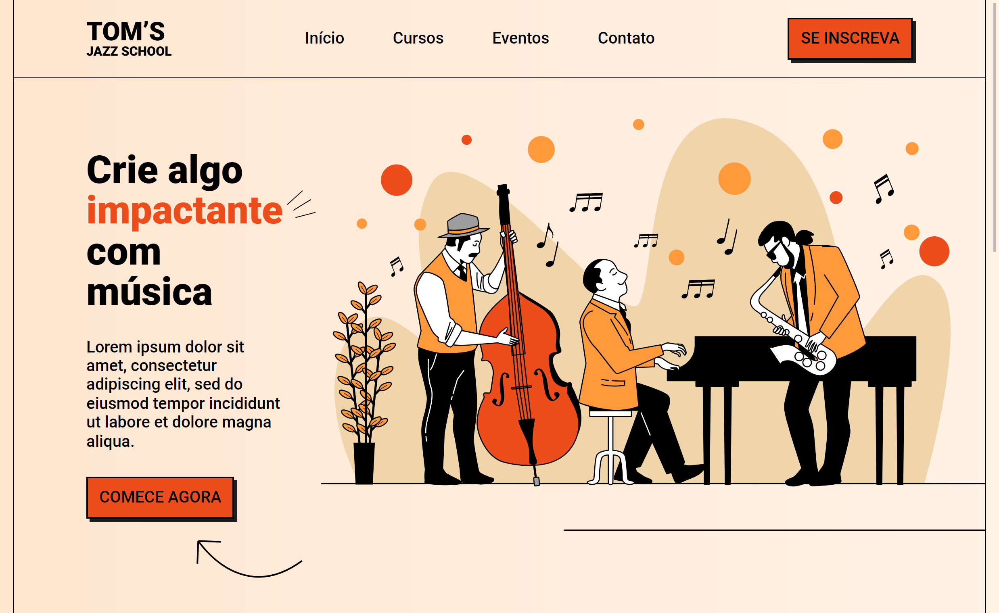

# Landing Page

Landing Page Responsiva e Mobile-First em parceria com a OneBitCode 🤘

Criando uma landing page com base no modelo do Figma, utilizando HTML e CSS e seguindo a metodologia Mobile First.

[Projeto online](https://barbaraishioka.github.io/landing-page-onebitcode)

[Aulas OneBitCode](https://www.onebitcode.com/projetoaulas)

[Figma](https://www.figma.com/file/76GJ4uK7PyKeAo6dcpVyjA/Tom's-Jazz-School)



## Tecnologias

- HTML
- CSS

## Instalação

```bash
git clone https://github.com/barbaraishioka/landing-page-onebitcode.git

cd start-landing-page-onebitcode
```

## Licença

Este projeto está licenciado sob os termos da Licença MIT.
